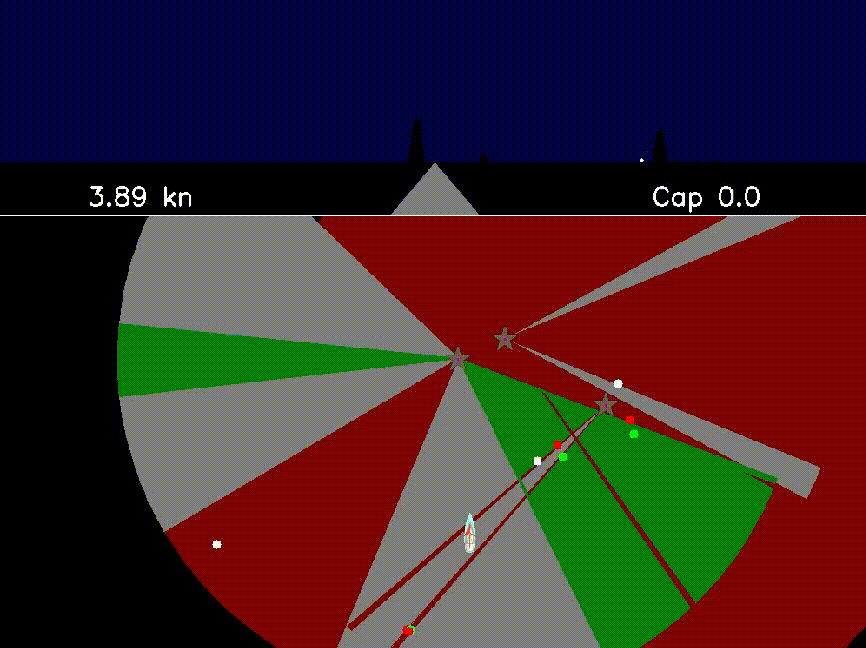

# Simulation de navigation de nuit

Le programme `feu.py` simule la navigation d'un bateau de nuit dans une zone.

Il peut lire un fichier de zone ou prendre un motif de feu.

## Déplacement du bateau

Le bateau bouge et tourne avec les flèches du clavier. On peut imposer une dérive (en nœuds, direction sud) avec:

`feu.py -d derive`

Le bateau ralentit à proximité des obstacles et des bords de secteurs, la distance se change avec :

`feu.py -o <distance en M>`

## Simulation feu unique

`feu.py -p <motif>` où le motif est écrit comme sur les cartes Shom:

- Fl(2)G.3s
- Iso.4s28m
- Raccourcis pour les cardinales: `N,E,S,W`

## Fichier de zone

`feu.py -f <fichier zone>` où certains fichiers sont disponibles dans le dossier `zones`.
Les coordonnées GPS sont obtenus depuis `data.shom.fr` en mode sexagesimal.

### Position de départ

Le champ  `start` doit contenir la position GPS initiale du bateau

### Feux sans secteur

Un champ avec le motif du feu contenant sa position

### Feux avec secteurs

Un champ avec le motif du feu contenant:

    - un champ `pos` indiquant la position GPS
    - des champs de la couleur (`W1, R1, R2, G1...`) indiquant la position GPS d'un point sur le bord tribord du secteur
    - utiliser `B` (ou `B1, B2...`) pour un secteur sans lumière

## Exemples

Dans le dossier `zones`, quelques exemples en Bretagne
